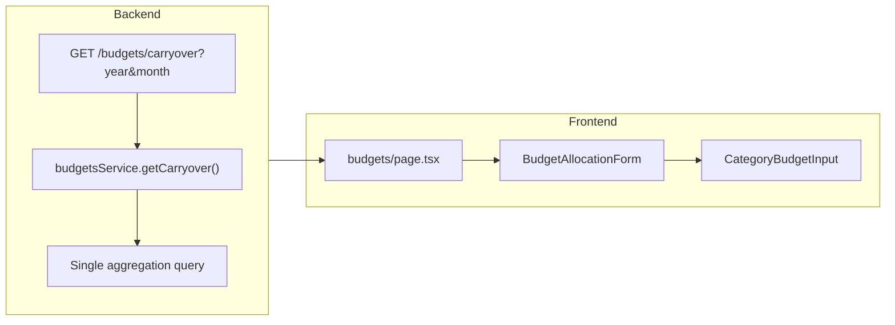

# Budget Carryover Feature

Add cumulative remaining value calculation (budgeted minus spent from all previous months) per account/category, displayed when creating budgets.

## Backend Changes

### 1. New Endpoint: `GET /budgets/carryover`

Add a new endpoint in [`src/budgets/budgets.controller.ts`](src/budgets/budgets.controller.ts) that accepts `year` and `month` query parameters and returns the cumulative carryover for each account-category combination.**Query Strategy (single performant query)**:

```sql
SELECT 
  account_id,
  category_id,
  COALESCE(SUM(budgets.value), 0) - COALESCE(SUM(expenses.value), 0) as remaining
FROM categories
LEFT JOIN budgets ON ... WHERE date < selected_month
LEFT JOIN expenses ON ... WHERE date < selected_month
GROUP BY account_id, category_id
```


### 2. New DTOs

Create input/output DTOs:

- `GetCarryoverQueryInputDto` - validates year/month query params
- `GetCarryoverOutputDto` - array of `{ accountId, categoryId, remaining }`

### 3. Service Method

Add `getCarryover(userId, year, month)` method in [`src/budgets/budgets.service.ts`](src/budgets/budgets.service.ts) that:

- Calculates `SUM(budgets.value) - SUM(expenses.value)` for all records before the specified month
- Groups by accountId and categoryId
- Returns only non-zero carryover values

## Frontend Changes

### 1. API Schema

Add new schema in [`lib/api-schemas.ts`](lib/api-schemas.ts):

```typescript
export const carryoverSchema = z.array(z.object({
  accountId: z.number(),
  categoryId: z.number(),
  remaining: z.coerce.number(),
}));
```


### 2. Fetch Carryover Data

In [`app/budgets/page.tsx`](app/budgets/page.tsx), add a new query to fetch carryover data for the selected month.

### 3. Display in Budget Form

Update [`components/budget-allocation-form.tsx`](components/budget-allocation-form.tsx) and [`components/category-budget-input.tsx`](components/category-budget-input.tsx) to:

- Accept carryover data as a prop
- Display the remaining value from previous months next to each category input
- Optionally show a visual indicator (positive = green, negative = red)



## Files to Modify

| File | Change ||------|--------|| `backend/.../budgets.controller.ts` | Add `GET /budgets/carryover` endpoint || `backend/.../budgets.service.ts` | Add `getCarryover()` method with aggregation query || `backend/.../dto/` | Add 2 new DTO files for carryover || `frontend/.../api-schemas.ts` | Add carryover schema || `frontend/.../budgets/page.tsx` | Fetch and pass carryover data |